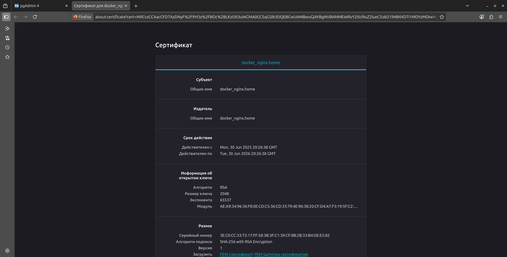

# Проект автоматизации инфраструктуры

Данный проект использует Vagrant с провайдером libvirt для создания и управления виртуальными машинами, а также Ansible для автоматизации их конфигурации.

## Требования к системе

- Linux (рекомендуется Ubuntu)
- Python 3.x, pip
- Достаточно ресурсов для запуска виртуальных машин (RAM:7-10GB)

## Установка зависимостей

### 1. Vagrant

#### Официальная установка (из-за санкций может быть недоступна установка с сайта и репозиториев):
```bash
# Скачайте и установите с официального сайта
# https://developer.hashicorp.com/vagrant/install
```

#### Установка через Homebrew (не блокирует - актуально на июнь 2025год):
```bash
brew tap hashicorp/tap
brew install hashicorp/tap/vagrant
```

### 2. libvirt + QEMU/KVM (провайдер виртуализации для Linux)

# Обновление списка пакетов (рекомендуется)
```bash
sudo apt update
```

# Установка необходимых пакетов
```bash
sudo apt install -y qemu-kvm libvirt-daemon-system libvirt-clients
```
# Добавление пользователя в группу libvirt
```bash
sudo adduser "$USER" libvirt
```
# Применение изменений группы (рекомендуется перезагрузка)
```bash
newgrp libvirt
```
# или
```bash
sudo reboot (рекомендую перезагрузить)
```

### 3. Плагин Vagrant Libvirt

```bash
vagrant plugin install vagrant-libvirt
```
### 4. pip

Необходим для requirements.txt:

# Установка pip
```bash
sudo apt install python3-pip
```

### 5. Ansible

Рекомендуется использовать виртуальное окружение Python:

# Создание виртуального окружения
```bash
python3 -m venv venv
```
# Активация виртуального окружения
```bash
source venv/bin/activate
```
# Обновление pip
```bash
pip install --upgrade pip
```
# Установка зависимостей из requirements.txt
```bash
pip install -r requirements.txt
```
### 6. PostgreSQL Client

Для подключения к базам данных PostgreSQL на виртуальных машинах:

# Установка PostgreSQL клиента
```bash
sudo apt install -y postgresql-client
```
# Альтернативно, только клиент без сервера
```bash
sudo apt install -y postgresql-client-common postgresql-client-16
```

## Проверка установки

### Проверка Vagrant:
```bash
vagrant version
```

### Проверка libvirt:
```bash
virsh version
```

### Проверка Ansible:
```bash
ansible --version
```
# Ожидаемый вывод: ansible [core 2.16.9]

### Проверка PostgreSQL Client:
```bash
psql --version
```
# Ожидаемый вывод: psql (PostgreSQL) 16.x

## Использование

1. Убедитесь, что виртуальное окружение Python активировано:
   ```bash
   source venv/bin/activate
   ```

2. Настройте пользовательскую сеть:
   ```bash
   ./setup_network.sh
   ```

3. Запустите виртуальные машины с помощью Vagrant:
   ```bash
   vagrant up
   ```
   # Если что-то пошло не так: полное удаление виртуалок
      ```bash
   vagrant destroy -f
   ```
   # Возможны проблемы (санкции) с автоматической загрузкой нужного образа. В этом случае его (generic/ubuntu2204) можно найти и скачать вручную:
   [hashicorp](https://portal.cloud.hashicorp.com/vagrant/discover)
   [google drive](https://drive.google.com/drive/folders/1O-MM4JEZBYJ_P8kNnvwHfdfPCL1qt2oF?usp=drive_link) 
   # После скачивания файла, добавьте его в Vagrant:
      ```bash
   vagrant box add generic/ubuntu2204 ./generic-ubuntu2204
   ```
   # Путь ./generic-ubuntu2204 указывается относительно текущей рабочей директории, из которой выполняется команда.

   # Подключение к виртуалкам
   ```bash
   vagrant ssh dockerNginx
   ```
   ```bash
   vagrant ssh dockerPgadminPostgres
   ```

4. Выполните конфигурацию с помощью Ansible:
   ```bash
   ansible-playbook playbook.yml --ask-vault-pass
   ```
   # Попросит ввести пароль: ту-ту-ту трам-пам-пам

   # Vault: pgAdmin + Postgres 
      ```bash
   ansible-vault view secrets.yml
   ```

## Управление сетью

### Создание пользовательской сети:
```bash
./setup_network.sh
```
### Удаление пользовательской сети:
```bash
./remove_custom_net.sh
```

## Структура проекта

```
.
├── README.md                 # Документация проекта
├── requirements.txt          # Python зависимости
├── Vagrantfile              # Конфигурация виртуальных машин
├── ansible.cfg              # Конфигурация Ansible
├── inventory.yml            # Инвентарь хостов
├── playbook.yml             # Основной playbook
├── secrets.yml              # Зашифрованные переменные (Ansible Vault)
├── custom_net.xml           # Конфигурация пользовательской сети
├── setup_network.sh         # Скрипт настройки сети
├── remove_custom_net.sh     # Скрипт удаления пользовательской сети
├── .gitignore              # Игнорируемые файлы Git
├── group_vars/             # Групповые переменные Ansible
├── roles/                  # Роли Ansible
├── .vagrant/               # Служебные файлы Vagrant
└── logs-and-screenshots/    # Папка со скриншотами и немного текста
```

## Устранение неполадок

### Проблемы с правами доступа к libvirt:
# Убедитесь, что пользователь добавлен в группу libvirt
```bash
groups $USER
```
# Если группы libvirt нет, добавьте пользователя заново
```bash
sudo adduser "$USER" libvirt
```
```bash
sudo reboot
```

### Проблемы с плагином vagrant-libvirt:
# Переустановка плагина
```bash
vagrant plugin uninstall vagrant-libvirt
```
```bash
vagrant plugin install vagrant-libvirt
```

## Дополнительные ресурсы

- [Документация Vagrant](https://developer.hashicorp.com/vagrant/docs)
- [Документация Ansible](https://docs.ansible.com/)
- [Vagrant Libvirt Provider](https://vagrant-libvirt.github.io/vagrant-libvirt/)

## Скриншоты





## Трудности/неочевидные моменты: # будем понемногу заполнять
- pgAdmin: если в volume уже сохранены данные, то при перезапуске контейнера переменные PGADMIN_DEFAULT_EMAIL и PGADMIN_DEFAULT_PASSWORD игнорируются — новый пользователь не создаётся. Это нормальное поведение, поскольку pgAdmin считает, что "настройка уже была выполнена".
   Варианты решения:
      - Удалить volume с данными (pgadmin_data), чтобы pgAdmin создал пользователя заново;
      - Либо вручную сбросить пароль через SQLite-базу pgadmin4.db;
      - Либо изменить пароль через веб-интерфейс, если у тебя есть доступ к существующему пользователю.
   Важно: изменение пароля через UI не конфликтует с PGADMIN_DEFAULT_PASSWORD — это значение используется только один раз при первом запуске, потом игнорируется.

- VPN: при подключении VPN может изменить маршруты сети и повлиять на доступ к локальным ресурсам. В зависимости от операционной системы и настроек, VPN       способен:
   - перехватывать трафик даже к localhost (loopback), что может нарушить работу локальных сервисов;
   - перенаправлять или блокировать соединения с внутренними IP-адресами, например 192.168.x.x;
   - автоматически добавлять переменные окружения (например, переменная окружения: http://127.0.0.1:12334), которые мешают отладке и работе некоторых приложений.

